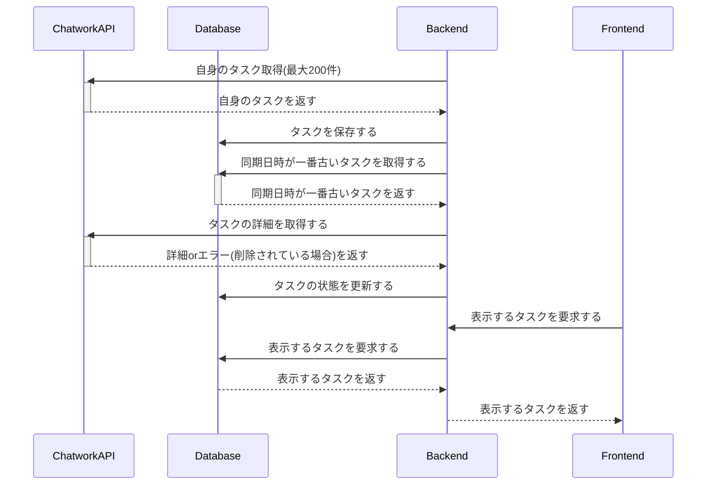

# 新タスク同期  

```mermaid
sequenceDiagram
    participant ChatworkAPI
    participant Database
    participant Backend
    participant Frontend
    Backend->>+ChatworkAPI: 自身のタスク取得(最大200件)
    activate ChatworkAPI
    ChatworkAPI-->>Backend: 自身のタスクを返す
    deactivate ChatworkAPI
    Backend->>Database: タスクを保存する
    
    Backend->>Database: 同期日時が一番古いタスクを取得する
    activate Database
    Database-->>Backend: 同期日時が一番古いタスクを返す
    deactivate Database
    Backend->>ChatworkAPI: タスクの詳細を取得する
    activate ChatworkAPI
    ChatworkAPI-->>Backend: 詳細orエラー(削除されている場合)を返す
    deactivate ChatworkAPI
    Backend->>Database: タスクの状態を更新する
    Frontend->>Backend: 表示するタスクを要求する
    Backend->>Database: 表示するタスクを要求する
    Database-->>Backend: 表示するタスクを返す
    Backend-->>Frontend: 表示するタスクを返す
```